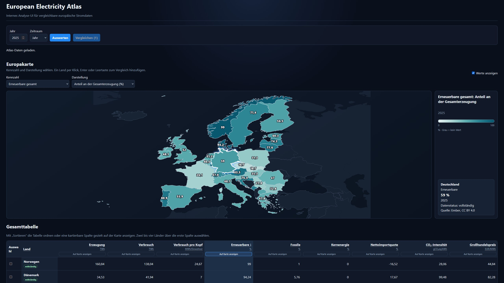

# European Electricity Atlas

Ein lokaler, interaktiver Atlas für den Vergleich europäischer Stromsysteme. Die Weboberfläche verbindet eine kennzahlengesteuerte Europakarte mit sortierbaren Tabellen, Länder­vergleichen und transparenten Angaben zu Datenstatus und Quellen.



## Was der Atlas bietet

- 31 europäische Länder mit Monats- und Jahreswerten ab 2015
- Stromerzeugung, Nachfrage, Energiemix, Nettoimporte und CO₂-Intensität
- nationale monatliche und jährliche Großhandelspreise
- jährliche Bevölkerungs- und BIP-Kennzahlen sowie Pro-Kopf-Auswertungen
- Batterie- und Pumpspeicherleistung, -energie und äquivalente Entladedauer als getrennte Bestandswerte
- vollständig lokale Europakarte ohne Kartenkacheln, CDN oder Tracking
- interaktiver Zeitreihenvergleich für ein bis zehn Länder mit Atlas-Durchschnitt, Direktlink und lokalen Exporten
- sichtbare Coverage-Lücken, vorläufige Zeiträume und YTD-Werte statt erfundener Nullwerte

## Schnellstart mit fertigem Datenstand

### Voraussetzungen

- Windows mit PowerShell
- Git
- Python 3.11 oder neuer
- Zugriff auf dieses private GitHub-Repository

Repository klonen und eine lokale Python-Umgebung einrichten:

```powershell
git clone https://github.com/Captain-Boba/EEA.git
cd EEA

py -3 -m venv .venv
.\.venv\Scripts\python.exe -m pip install -e .
```

Im [aktuellen Release](https://github.com/Captain-Boba/EEA/releases/latest) unter **Assets** die Datei `atlas.sqlite3` herunterladen und im geklonten Projekt unter `data\atlas.sqlite3` ablegen. Der Release-Datenstand benötigt weder einen Ember-API-Key noch einen erneuten Import.

Server starten:

```powershell
.\.venv\Scripts\eea.exe serve --port 8765
```

Danach [http://127.0.0.1:8765](http://127.0.0.1:8765) öffnen. `Strg+C` beendet den Server; sobald wieder der PowerShell-Prompt erscheint, ist er gestoppt.

## Datenquellen

| Quelle | Verwendung | Zeitbezug |
| --- | --- | --- |
| [Ember](https://ember-energy.org/) | Erzeugung, Nachfrage, Energiemix, Nettoimporte und CO₂-Intensität | Monat und Jahr |
| [Ember Wholesale Electricity Price Data](https://ember-energy.org/data/european-wholesale-electricity-price-data/) | nationale Großhandelspreise | Monat und daraus gewichtetes Jahr |
| [Eurostat](https://ec.europa.eu/eurostat/) | Bevölkerung, BIP und BIP pro Kopf | Jahr |
| [Battery-Charts](https://battery-charts.de/) | vollständiger deutscher stationärer Batteriebestand aus dem bereinigten MaStR | monatlicher Bestandswert |
| [JRC European Energy Storage Inventory](https://ses.jrc.ec.europa.eu/storage-inventory) | operative Batterieprojekte außerhalb Deutschlands und Pumpspeicher aller Länder | API-Snapshot |
| [Natural Earth](https://www.naturalearthdata.com/) | lokale Ländergeometrien der Europakarte | Version 5.1.1 |
| [flag-icons](https://github.com/lipis/flag-icons) | lokale SVG-Länderflaggen im Zeitreihenvergleich | Version 7.4.0, MIT |

Ember- und Battery-Charts-Daten werden als `CC BY 4.0` gekennzeichnet. Natural-Earth-Geometrien sind gemeinfrei. Für Eurostat gelten dessen Wiederverwendungsbedingungen und Ausnahmen. Die JRC-Bestandsdaten können Schätzungen sowie Daten externer Anbieter enthalten; ihre Weitergabe muss vor einer öffentlichen oder kommerziellen Veröffentlichung gesondert geprüft werden.

## Daten selbst aktualisieren

Dieser Abschnitt ist nur erforderlich, wenn nicht der fertige Release-Snapshot verwendet wird oder ein neuerer Datenstand aufgebaut werden soll.

### Ember-Stromdaten

Der Key wird zuerst aus `EMBER_API_KEY` und andernfalls aus der lokalen, von Git ignorierten Datei `EMBER_API_KEY.txt` gelesen. Er wird weder ausgegeben noch in SQLite gespeichert; gecachte Request-URLs enthalten ausschließlich `api_key=REDACTED`.

```powershell
$env:EMBER_API_KEY = "<API-Key>"
.\.venv\Scripts\eea.exe import --from-year 2015
```

Der historische Cache wird wiederverwendet. `--refresh` erzwingt den erneuten Abruf und atomaren Ersatz des ausdrücklich angeforderten Zeitraums. Alternativ lassen sich einzelne Jahre, Monate oder Länder importieren:

```powershell
.\.venv\Scripts\eea.exe import --year 2025
.\.venv\Scripts\eea.exe import --year 2025 --countries DE FR ES UK
.\.venv\Scripts\eea.exe import --year 2025 --months 1 7
```

### Großhandelspreise und Eurostat

```powershell
.\.venv\Scripts\eea.exe import-prices
.\.venv\Scripts\eea.exe import-eurostat --from-year 2015
```

Beide Befehle benötigen Internetzugang, aber keinen API-Key. Antworten werden vollständig validiert, bevor vorhandene Daten atomar ersetzt werden. Eurostat-Anfragen laufen bewusst sequenziell und beachten begrenztes Backoff sowie `Retry-After`.

### Batterie- und Pumpspeicherbestand

Battery-Charts wird derzeit ausschließlich aus zwei manuell gespeicherten JSON-Antworten importiert. Der Atlas verwendet keinen Battery-Charts-Key und führt keinen Request an deren JSON-Endpunkt aus:

```powershell
.\.venv\Scripts\eea.exe import-battery-storage `
  --energy-file .\battery-energy.json `
  --power-file .\battery-power.json
```

Beide Dateien werden gemeinsam vollständig validiert und erst danach atomar importiert. Rohantworten und SHA-256 bleiben im lokalen Quellcache erhalten. Bei einem Fehler bleibt der bisherige deutsche Batteriebestand unverändert.

JRC besitzt davon getrennt einen bewussten Online-Aktualisierungsbefehl:

```powershell
.\.venv\Scripts\eea.exe update-storage
```

Ein frischer Monatscache verhindert den JRC-Netzwerkaufruf. `--refresh` umgeht diese Monatsprüfung bewusst, bleibt aber auf einen JRC-Request begrenzt. Bei 403 oder 429 erfolgt kein Retry; bei Timeout oder 5xx höchstens einer nach mindestens zehn Sekunden. Der Befehl kann Battery-Charts technisch nicht abrufen.

Deutschland verwendet für Batterien ausschließlich den nationalen Battery-Charts-Gesamtbestand. Andere Länder verwenden den bei JRC erfassten Projektbestand; Pumpspeicher stammen für alle Länder aus JRC. Werte unterschiedlicher Quellen werden niemals addiert. Der bisherige Befehl `import-storage` bleibt als veralteter Offline-Fallback für geprüfte JRC-CSV/XLSX-Dateien verfügbar. Details stehen in [JRC_STORAGE_IMPORT.md](docs/JRC_STORAGE_IMPORT.md).

## Datenmodell und Qualitätsregeln

`period_observation` ist die kanonische Faktentabelle. Der Monat ist die kleinste Einheit für Strom- und Preisdaten; geprüfte Jahreswerte sowie separat datierte Speicherbestände werden getrennt gespeichert. `api_cache` enthält redigierte Ember-JSON-Antworten, `source_cache` unveränderte Preis-, Eurostat-, JRC- und Battery-Charts-Rohantworten samt Abrufmetadaten und SHA-256.

- fehlende Werte bleiben `null` und erscheinen in der Oberfläche als `—`
- aktuelle Monate und Jahre werden als vorläufig beziehungsweise YTD gekennzeichnet
- Jahresnachfrage wird nur aus genau zwölf vorhandenen Monatswerten abgeleitet
- Jahrespreise werden nach tatsächlicher Monatsdauer gewichtet
- positive Nettoimporte bedeuten Importüberschuss, negative Werte Exportüberschuss
- Eurostat-Denominatoren werden nur mit Stromwerten desselben Kalenderjahres kombiniert
- fehlerhafte Aktualisierungen dürfen vorhandene Daten nicht verändern

Eine frische, noch nicht vorhandene SQLite-Datei wird beim Serverstart initialisiert. Die API arbeitet anschließend read-only.

## Lokale API

- `/api/countries`
- `/api/metrics`
- `/api/summary?year=2025`
- `/api/summary?year=2025&month=7`
- `/api/compare?year=2025&countries=DE,FR`
- `/api/timeseries?metric=renewable_share_pct&countries=DE,FR,UK&start=2015-01&end=2026-08`
- `/api/coverage?year=2025`
- `/api/storage`

Die Weboberfläche führt selbst keine Importe aus und lädt zur Laufzeit keine externen Kartenressourcen.

## Entwicklung und Tests

Es gibt keine Laufzeitabhängigkeiten außerhalb der Python-Standardbibliothek.

```powershell
$env:PYTHONPATH = "$PWD\src"
.\.venv\Scripts\python.exe -m unittest discover -s tests -v
git diff --check
```

Die Tests verwenden ausschließlich lokale Fixtures und führen keine Live-Importe aus.

## Weiterführende Dokumentation

- [Projekt-Roadmap](ROADMAP.md)
- [Ember-Coverage](docs/EMBER_COVERAGE.md)
- [JRC-Speicherimport](docs/JRC_STORAGE_IMPORT.md)
- [Lokale Europakarte und Natural-Earth-Provenienz](docs/MAP_ASSET.md)

## Bekannte Einschränkungen

- Einzelne historische Land-Monat-Kombinationen können reguläre Coverage-Lücken besitzen.
- Bruttoimport, Bruttoexport, negative Preisstunden und operative Intervallstatistiken sind nicht Teil des Monatsatlas.
- JRC-Speicherwerte bilden den erfassten operativen Projektbestand ab, nicht zwingend einen vollständigen nationalen Gesamtbestand und nicht die Wasserkraft-Magazinkapazität.
- Zeitreihenplots interpolieren keine Lücken. Der Atlas-Durchschnitt ist je Zeitpunkt das arithmetische Mittel aller vorhandenen Werte des vollständigen Länderkatalogs.
- Außerhalb Deutschlands werden fehlende Heim- oder Gewerbebatterien nicht geschätzt. Fehlende JRC-Energie bleibt leer und wird nicht aus Leistung oder Projektdaten erfunden.
- Die öffentliche JRC-Projekt-API ist nicht formal versioniert; Strukturänderungen führen deshalb bewusst zu einem abgebrochenen, bestandserhaltenden Import.
