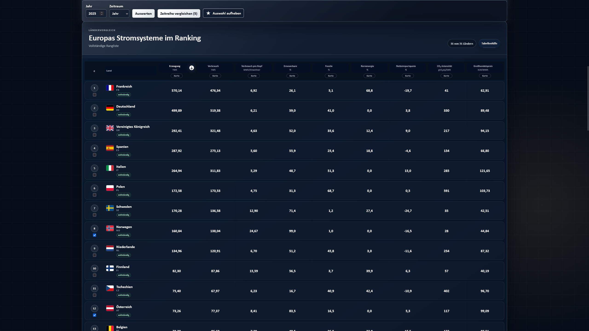
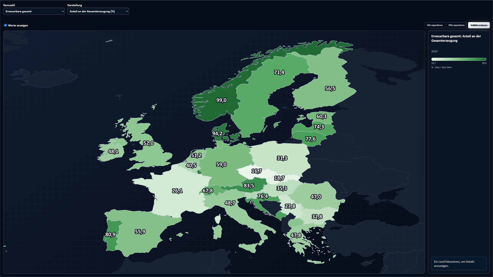
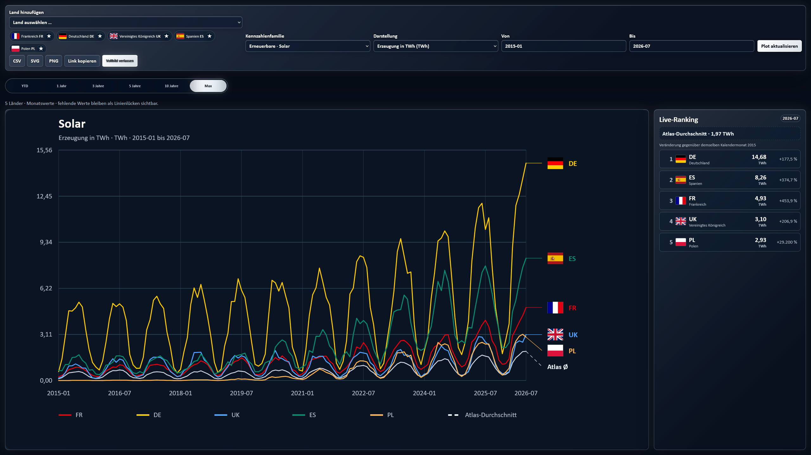

# European Electricity Atlas

A local, interactive atlas for comparing European electricity systems. The web interface combines a metric-driven map of Europe with sortable rankings, country comparisons, and transparent information about data status and sources.

## The interface

### European electricity systems ranked side by side

The main country table compares all 31 Atlas countries using consistently formatted metrics. Every column can be sorted and opened directly as a map layer, while rank numbers always follow the active sorting. Countries can be selected in the table for time-series comparison, and the sticky control bar keeps the year, period, and comparison selection within reach while scrolling.

[](docs/images/635948733-e09e9264-de92-4c8d-ab92-8527c1364e4c.png)

### Every metric on the map of Europe

The fully local SVG map visualizes absolute and relative metrics with dedicated color scales and visible country values. Metric family and representation can be selected independently. In fullscreen mode, the legend remains available beside the map. The current map state can be exported as SVG or PNG, including its title, period, unit, color scale, and legend.

[](docs/images/635950624-7224dc4b-6424-47dd-96f3-5e07735b9178.png)

### Time series for up to ten countries

The time-series comparison combines monthly or annual values with an Atlas average and a live ranking. Preset ranges from YTD to the full available history complement the custom date range. Relative changes use a fixed 2015 baseline; monthly values are always compared with the same calendar month in 2015. Missing values remain visible as genuine gaps in the lines. The current comparison can be shared through a direct link or exported locally as CSV, SVG, and PNG.

[](docs/images/635949655-624b34af-c665-4e2e-870c-1f1ca4da9d98.png)

## What the Atlas offers

- 31 European countries with monthly and annual values from 2015 onwards
- electricity generation, demand, generation mix, net imports, and CO₂ intensity
- national monthly and annual wholesale electricity prices
- annual population and GDP metrics, including per-capita evaluations
- separate battery and pumped-storage power, energy capacity, and equivalent discharge duration snapshots
- a fully local map of Europe without map tiles, CDNs, or tracking
- a compact, fullscreen-capable time-series comparison for one to ten countries with an Atlas average, 2015 baseline, shareable links, and local exports
- visible coverage gaps, provisional periods, and YTD values instead of fabricated zeroes

## Quick start with a ready-made data snapshot

### Prerequisites

- Windows with PowerShell
- Git
- Python 3.11 or newer
- access to this private GitHub repository

Clone the repository and create a local Python environment:

```powershell
git clone https://github.com/Captain-Boba/EEA.git
cd EEA

py -3 -m venv .venv
.\.venv\Scripts\python.exe -m pip install -e .
```

Download `atlas.sqlite3` from the **Assets** section of the [latest release](https://github.com/Captain-Boba/EEA/releases/latest) and place it at `data\atlas.sqlite3` inside the cloned repository. The release snapshot requires neither an Ember API key nor a fresh import.

Start the server:

```powershell
.\.venv\Scripts\eea.exe serve --port 8765
```

Open [http://127.0.0.1:8765](http://127.0.0.1:8765). Press `Ctrl+C` to stop the server; it is stopped once the PowerShell prompt returns.

## Data sources

| Source | Use | Time basis |
| --- | --- | --- |
| [Ember](https://ember-energy.org/) | generation, demand, generation mix, net imports, and CO₂ intensity | month and year |
| [Ember Wholesale Electricity Price Data](https://ember-energy.org/data/european-wholesale-electricity-price-data/) | national wholesale electricity prices | month and weighted annual value |
| [Eurostat](https://ec.europa.eu/eurostat/) | population, GDP, and GDP per capita | year |
| [Battery-Charts](https://battery-charts.de/) | complete German stationary battery fleet from the cleaned MaStR | monthly inventory value |
| [JRC European Energy Storage Inventory](https://ses.jrc.ec.europa.eu/storage-inventory) | operational battery projects outside Germany and pumped storage in all countries | API snapshot |
| [Natural Earth](https://www.naturalearthdata.com/) | local country geometries for the map of Europe | version 5.1.1 |
| [flag-icons](https://github.com/lipis/flag-icons) | local SVG country flags in the time-series comparison | version 7.4.0, MIT |

Ember and Battery-Charts data are identified as `CC BY 4.0`. Natural Earth geometries are in the public domain. Eurostat data are subject to Eurostat's reuse policy and exceptions. JRC inventory data may include estimates and third-party data; redistribution must be reviewed separately before any public or commercial data release.

## Updating the data yourself

This section is only required when the ready-made release snapshot is not used or a newer data snapshot needs to be built.

### Ember electricity data

The key is read first from `EMBER_API_KEY` and otherwise from the local, Git-ignored `EMBER_API_KEY.txt` file. It is neither printed nor stored in SQLite; cached request URLs contain only `api_key=REDACTED`.

```powershell
$env:EMBER_API_KEY = "<API-Key>"
.\.venv\Scripts\eea.exe import --from-year 2015
```

The historical cache is reused. `--refresh` forces a new request and atomically replaces only the explicitly requested period. Individual years, months, or countries can also be imported:

```powershell
.\.venv\Scripts\eea.exe import --year 2025
.\.venv\Scripts\eea.exe import --year 2025 --countries DE FR ES UK
.\.venv\Scripts\eea.exe import --year 2025 --months 1 7
```

### Wholesale electricity prices and Eurostat

```powershell
.\.venv\Scripts\eea.exe import-prices
.\.venv\Scripts\eea.exe import-eurostat --from-year 2015
```

Both commands require internet access but no API key. Responses are fully validated before existing data are replaced atomically. Eurostat requests run sequentially by design and respect limited backoff and `Retry-After`.

### Battery and pumped-storage inventories

Battery-Charts is currently imported exclusively from two manually saved JSON responses. The Atlas does not use a Battery-Charts key and never requests its JSON endpoint:

```powershell
.\.venv\Scripts\eea.exe import-battery-storage `
  --energy-file .\battery-energy.json `
  --power-file .\battery-power.json
```

Both files are validated together and imported atomically only after validation succeeds. Raw responses and their SHA-256 hashes remain in the local source cache. If validation fails, the existing German battery inventory remains unchanged.

JRC has a separate, explicitly triggered online update command:

```powershell
.\.venv\Scripts\eea.exe update-storage
```

A fresh monthly cache prevents a JRC network request. `--refresh` deliberately bypasses the monthly cache check but remains limited to one JRC request. HTTP 403 and 429 responses are never retried; timeouts and 5xx responses receive at most one retry after at least ten seconds. The command cannot access Battery-Charts.

Germany uses only the national Battery-Charts total for batteries. Other countries use the project inventory recorded by JRC, while pumped storage comes from JRC for every country. Values from different sources are never added together. The existing `import-storage` command remains available as a deprecated offline fallback for reviewed JRC CSV/XLSX files. See [JRC_STORAGE_IMPORT.md](docs/JRC_STORAGE_IMPORT.md) for details.

## Data model and quality rules

`period_observation` is the canonical fact table. Month is the smallest unit for electricity and price data; validated annual values and separately dated storage inventories are stored independently. `api_cache` contains redacted Ember JSON responses. `source_cache` stores unchanged price, Eurostat, JRC, and Battery-Charts source responses together with retrieval metadata and SHA-256 hashes.

- missing values remain `null` and appear as `—` in the interface
- current months and years are marked as provisional or YTD
- annual demand is derived only when exactly twelve monthly values are available
- annual prices are weighted by the actual duration of each month
- positive net imports indicate an import surplus; negative values indicate an export surplus
- Eurostat denominators are combined only with electricity values from the same calendar year
- failed updates must not modify existing data

A new SQLite file is initialized automatically when the server starts. The API operates read-only afterwards.

## Local API

- `/api/countries`
- `/api/metrics`
- `/api/summary?year=2025`
- `/api/summary?year=2025&month=7`
- `/api/compare?year=2025&countries=DE,FR`
- `/api/timeseries?metric=renewable_share_pct&countries=DE,FR,UK&start=2015-01&end=2026-08`
- `/api/coverage?year=2025`
- `/api/storage`

The web interface never performs imports and loads no external map resources at runtime.

## Development and tests

There are no runtime dependencies outside the Python standard library.

```powershell
$env:PYTHONPATH = "$PWD\src"
.\.venv\Scripts\python.exe -m unittest discover -s tests -v
git diff --check
```

Tests use local fixtures exclusively and never perform live imports.

## Further documentation

- [Project roadmap](ROADMAP.md)
- [Ember coverage](docs/EMBER_COVERAGE.md)
- [JRC storage import](docs/JRC_STORAGE_IMPORT.md)
- [Local map of Europe and Natural Earth provenance](docs/MAP_ASSET.md)

## Known limitations

- Individual historical country-month combinations may contain legitimate coverage gaps.
- Gross imports, gross exports, negative-price hours, and operational interval statistics are outside the scope of the monthly Atlas.
- JRC storage values represent its recorded operational project inventory, not necessarily a complete national inventory and not the energy capacity of conventional hydropower reservoirs.
- Time-series plots do not interpolate gaps. At each point, the Atlas average is the arithmetic mean of all available values across the complete country catalog.
- Missing residential or commercial batteries outside Germany are not estimated. Missing JRC energy values remain empty and are not inferred from power or project metadata.
- The public JRC project API is not formally versioned. Structural changes therefore cause a deliberate, state-preserving import failure.
